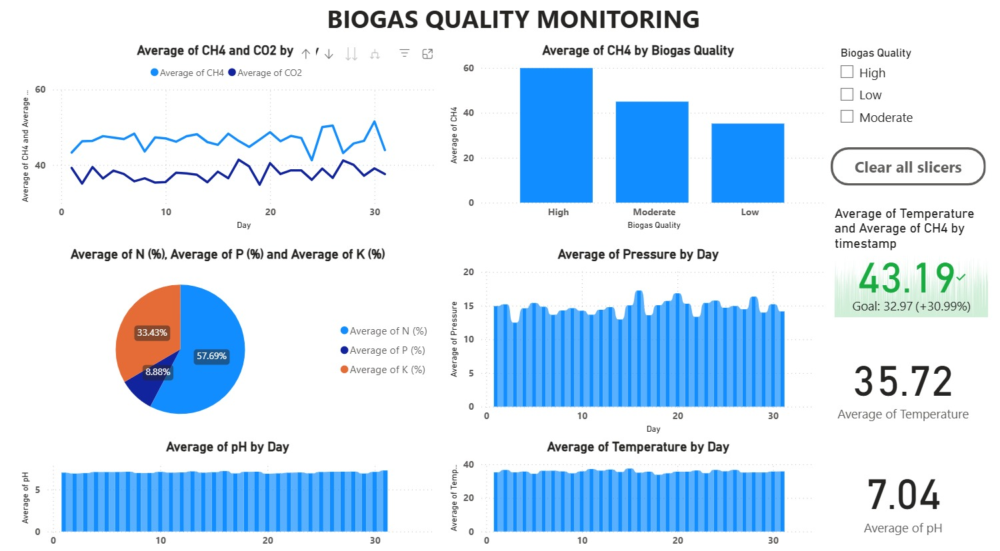

# 🌱 Biogas Plant with Smart Waste Segregation, Hybrid AI, and GenAI Integration

🚀 **Smart Waste Segregation and Recycling System powered by AI + IoT + GenAI**
This project showcases a complete **end-to-end solution** for biogas production optimization: from **AI-powered waste segregation**, to **biogas quality prediction using sensors**, to **real-time dashboards and mobile apps**, and finally a **GenAI chatbot and AI agent** for farmer/plant operator support.


---

## 📌 Problem Statement

Conventional biogas plants face two major challenges:

1. **Inefficient Waste Segregation** → leads to contamination and reduced gas yield.
2. **Unpredictable Biogas Quality** → lack of real-time monitoring makes it hard to optimize.

Our solution tackles both problems with **AI-driven automation** and **intelligent decision support**.

---

## 🌟 Key Features

✅ **AI-powered Waste Segregation** – Camera + CNN model to classify waste into *biogas-suitable* and *non-suitable*.
✅ **Hybrid Biogas Quality Prediction** – LSTM + XGBoost model using sensor data (pH, temperature, methane %, CO₂ %, pressure).
✅ **IoT Integration** – Real-time sensors continuously stream data.
✅ **Mobile Application** – Farmers/operators can monitor plant health, see dashboards, and chat with a GenAI assistant.
✅ **Power BI Dashboard** – Interactive visualization of energy produced, efficiency trends, and predictions.
✅ **GenAI Chatbot** – Integrated inside mobile app (mock using Ollama/GPT4All/free LLM).
✅ **AI Agent** – Automates tasks like alerting, optimization suggestions, and report generation.

---

## 🏗️ System Architecture

```mermaid
graph TD
A[Waste Input] --> B[AI Segregation Unit (CNN)]
B -->|Biogas-suitable| C[Mixing Tank & Digester]
C --> D[Biogas Production]
D --> E[Sensors (pH, Temp, Methane, CO₂, Pressure)]
E --> F[Hybrid AI Model (LSTM + XGBoost)]
F --> G[Dashboard (Power BI)]
F --> H[Mobile App]
H --> I[GenAI Chatbot]
```
---

## ⚙️ Setup & Installation

### 1️⃣ Clone the Repository

```bash
git clone https://github.com/JoelChandanshiv/Smart-Waste-Segregation-Recycling-and-Autonomous-Biogas-Plant.git
cd IIC United 3
```

### 2️⃣ Install Dependencies

```bash
pip install -r requirements.txt
```

### 3️⃣ Run Waste Segregation Model

```bash
cd segregation_ai_model
python inference.py --image sample_waste.jpg
```

### 4️⃣ Run Biogas Quality Prediction

```bash
cd biogas_quality_model
python predict.py --input sensor_data.json
```

### 5️⃣ Launch Mobile App

* Open `mobile_app/` in **Android Studio** (for Kotlin) .
* Run the emulator or connect a physical device.


## 📊 Dashboard (Power BI)



---

## 🤖 GenAI Chatbot & AI Agent

* **Chatbot** → Built using a free local LLM (Ollama). Integrated into the mobile app for answering farmer/operator queries.
* **AI Agent** → Uses LangChain/CrewAI to automate:

  * Alerts when methane % is too low
  * Generates daily plant performance report
  * Suggests corrective actions (e.g., “Add more organic waste, pH too low”)

---

🔥 With this project, we are not just **producing renewable energy**, but also **building the future of sustainable waste management using AI + IoT + GenAI**.
